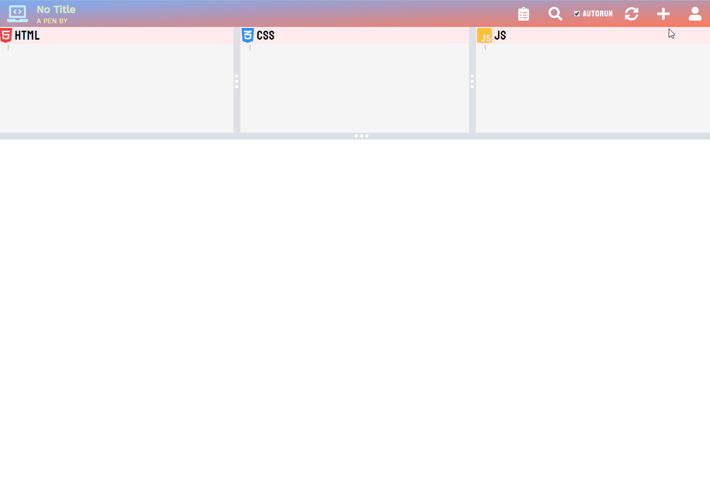
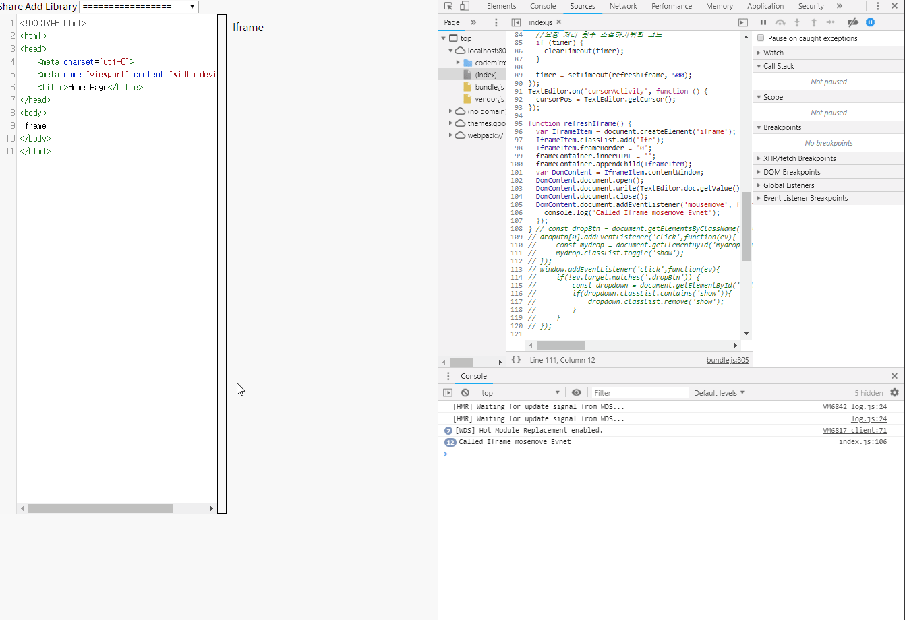

# [CodeFun](http://www.codefun.site)

[YouTube](https://www.youtube.com/watch?v=j6cE3Nop7FY)
---
CodeFun은 CodePen을 모티브하여 만든 프로젝트입니다. 코드 타이핑 결과를 바로 빠르게 확인할 수 있으며 프로젝트를 저장할수 있고, 훌륭한 프로젝트는 유저로부터 Star를 받아 주목받을수있습니다.<br>
[www.codefun.site](http://www.codefun.site)
## Installation
```
git clone https://github.com/donghyun95/CodeFun
cd FrontEnd
npm install
npm start
```

## Features
- JWT 기반 Login / Logout
- CDN Link 추가 / 수정 / 삭제
- Codemirror를 이용한 Code Editor
- Code Editor , Iframe Resizable
- Project Access 권한에 따라 Title 수정
- AutoRun Toggle
- Project Save시 UrlSharing
- Login된 유저와 Project를 작성한 유저 데이터일치시 삭제 아이콘 렌더링
- User 검색
- User 보유중인 Project List 확인
- 최신순으로 정렬된 Project 게시판
  - Infinite Scroll
  - 5초간격으로 새로 등록된 프로젝트 Data Api요청
- 페이스북 좋아요 기능과 유사한 Star
- Responsive layout

## Skills
 - React
 - Redux
 - Redux-thunk
 - Sass
 - axios
 - React-router
 - Jest
 - Enzyme
 - MongoDB [mLab](https://mlab.com/)
 - Express
 - jsonwebtoken

## Test
 - Component unit Test(Jest, Enzyme)
 - Reducer unit test (Jest)

## Deployment
 - Heroku

## Issues
### 1. Document 이벤트 와 Iframe 내부 Document 이벤트

Resizable 컴포넌트를 개발하는 과정에서 Document의 이벤트발생이 Iframe태그의 영역에서는 이벤트가 Iframe 내부의 Document에서 발생하므로 이벤트 호출이 서로 독립적이라는 문제에 마주치게되었습니다.
Iframe 컴포넌트의 최소한의 높이를 유지할 계획이였고 ,그에따라서 Iframe태그 내부로 마우스가 이동하더라도 mouseup 이벤트와 mousemove 이벤트를 Root Document에서 정상적으로 감지할 수 있어야했습니다.
이 상황에서 3가지 방법을 시도 해보았습니다.
 #### 1. Iframe 의 Document에 addEventListner를 등록하여 Root Document의 mouseup과 mousemove를 대신 호출하기
 width를 결정하기위해 Root Document의 event 객체를 기대했으나, 위의 설명대로 Iframe의 event객체를 가져오게되어 적절하지못했습니다.
 #### 2. Iframe Tag도 결국 Root Document의 Child node중 하나이므로 Event Capture 를 이용하여 Root Document에서 이벤트를 먼저 수신하고 전파하지않기
 
 event Capturing을 이용하는 두번째 생각이 적용이 되지않았고 , 
 Root document 와 Iframe document에서 발생하는 이벤트는 독립적이란것을 알아차렸습니다.<br>


 #### 3.Resizable 컴포넌트 클릭시 Iframe을 hidden 후, mouseup 시 다시 visible 하기
 Iframe 컴포넌트가 hidden으로 숨겨짐에 따라 Root Document로부터 Event를 잘 받아올 수 있어 Resizable이 정상적으로 잘 작동하지만, 사용자 입장에서는 hidden상태인 동안 하얀색의 배경만 보게되어 오류가 난듯한 느낌을 주었습니다.이러한 문제점을 개선하기위 하얀배경 대신 Spinner를 보여주는 방식으로 대체하였습니다.

### 2. Network resource waste
유저가 내용을 수정 할 때마다 새로 CDN을 요청을 하게되는데 수정 하는 과정에서 의미없이 너무 많은 CDN 요청을 보내고 있었습니다.유저가 불편을 느끼지 않는 선에서 결과를 확인할 수 있게 화면을 보여주는 방법을 고민해보았습니다.
유저의 입력이 멈춘뒤 0.5초간 추가적인 입력이 없다면 수정이 끝난상태로 간주하고 해당 코드를 구현함으로써 기존대비 80%가량 Network Resource를 아낄 수 있었습니다.

### 3.Node.js Max headerSize in Http.request
다수의 프로젝트를 저장 하고있는 유저가 로그인시도시 서버에서 400 Error를 반환하는 Issue가 있었습니다. Error에대해 검색해본결과
[Header size와 관련하여 400Error를 유추할 수 있었습니다.](https://m.blog.naver.com/PostView.nhn?blogId=elren&logNo=221106374837&proxyReferer=https%3A%2F%2Fwww.google.com%2F)
[Node.js Max headerSize in Http.request](https://stackoverflow.com/questions/24167656/nodejs-max-header-size-in-http-request)
>The HTTP protocol parser that Node uses appears to be hard-coded with a maximum header size of 80KB. Relevant constant. Since that is a compile-time constant, you would have to use a 
>custom-compiled version of Node to set that constant larger.
>
>It really sounds like the service you are using has made a mistake by putting that much data in a header though. Headers are meant for metadata about the request body. If they have that much 
>data to return, they should probably be including it in the request body.
>
>You could explore using an alternate HTTP parser like http-parser-js, since it doesn't appear to have a limit.

StackOverFlow 검색을 통해 Node.js 의 Maximum Header size가 80kb로 정해져있다는 사실을 알았고, 해당 원인은 JWT토큰을 통해 유저식별의 최소한의 정보만 전달해야함에도 불구하고 Database로부터 해당유저가 보유하고있는 프로젝트 내용까지 전부 포함되도록 작성된것을 체크하지못하였던것이 문제였습니다. 해당 Issue는 JWT토큰으로 전달하는 내용을 수정함으로써 해결하였습니다. 추가적으로 
[Maximum on http header values?](https://stackoverflow.com/questions/686217/maximum-on-http-header-values) 
Http의 Header는 size limit이 정해져있지 않지만, 다만 대부분의 (Apache,IIS,Tomcat과 같은)서버는 header size의 limit값으로 8kb를 기본값으로 설정하고있다. 라는 내용을 알 수 있었습니다.
